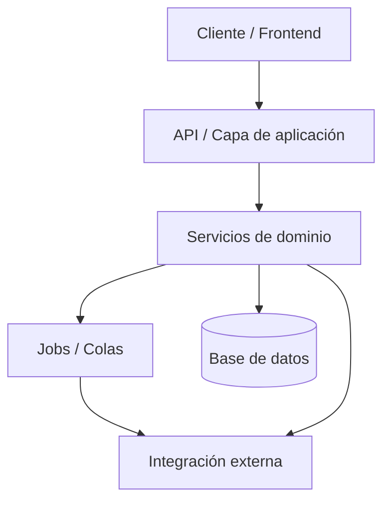
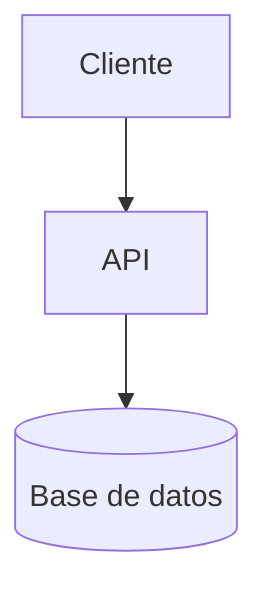
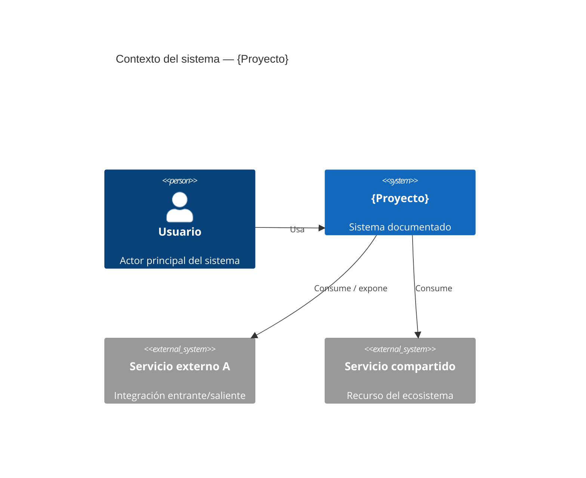
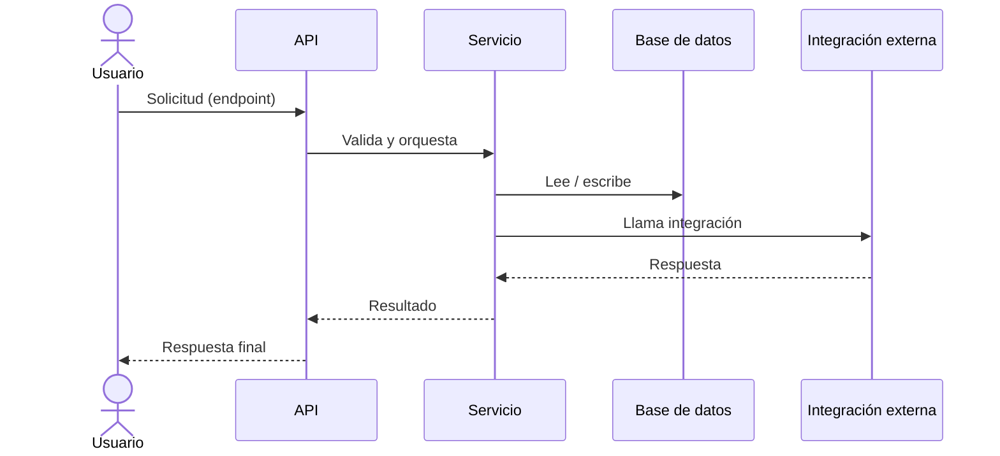
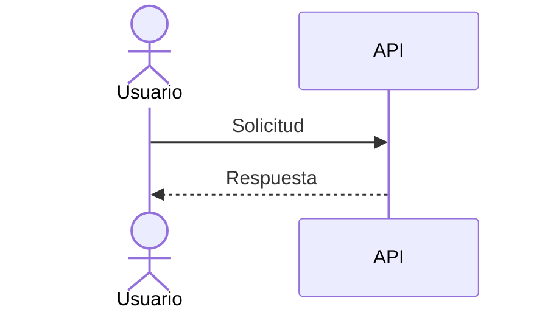
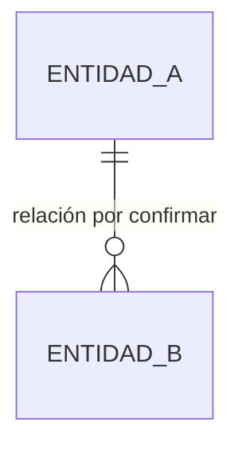

# Plantillas Mermaid para la documentación de proyecto

Plantillas reutilizables para los cuatro tipos de diagrama más comunes del ecosistema. Son punto de partida: adaptar nombres, capas y entidades a lo que las fuentes del proyecto declaren. Nunca completar un diagrama con información que no salga de una fuente verificable — lo inferido o ausente se marca como pendiente.

## Reglas comunes a todos los diagramas

Aplican a cualquier diagrama que esta skill inserte en Notion o exporte para `project-deck`:

1. **Título como primera línea útil:** `%% Título del diagrama %%`.
2. **Diagrama pendiente de verificación:** primera línea `%% PENDIENTE: fuente requerida: {qué} %%`. El cuerpo refleja solo lo inferible; lo que falte se deja anotado como comentario, no se inventa.
3. **Doble entrega:** el bloque `mermaid` va en la sección de Notion Y su código se guarda en `references/diagrams-export.md` de la documentación, para que `project-deck` lo consuma sin re-parsear la página.
4. **Proponer antes de insertar:** todo diagrama se muestra al usuario para aprobación.

## Tabla de selección — cuándo usar cada tipo

| Tipo | Sintaxis | Sección | Usar cuando... |
|---|---|---|---|
| Arquitectura | `graph TD` | Arquitectura técnica | Se muestran componentes/capas y cómo se conectan, en un solo sistema o servicio. |
| C4 (contexto) | `C4Context` | Arquitectura técnica | El proyecto es multi-repo o hay actores/sistemas externos; se quiere el mapa de alto nivel antes del detalle. |
| Secuencia | `sequenceDiagram` | Flujos principales | Se describe un flujo crítico paso a paso entre actores/servicios (máx. 5 flujos por snapshot). |
| ER | `erDiagram` | Modelo de datos | Se muestran entidades y relaciones. Fuente primaria: DDL o migraciones. |

Regla práctica: `graph TD` para el "qué hay y cómo se conecta" de un servicio; `C4Context` cuando importa el "quién habla con quién" a nivel ecosistema. Si dudas entre ambos, empieza por `C4Context` para el panorama y usa `graph TD` para el detalle interno de un componente.

---

## 1. Arquitectura de alto nivel — `graph TD`

Para capas, servicios, jobs y middleware de un sistema y sus conexiones internas.



Versión pendiente (sin fuente confirmada de la arquitectura):



---

## 2. Contexto C4 — `C4Context`

Para el panorama de un ecosistema multi-repo: actores, el sistema documentado y los sistemas externos con los que habla.



Usar `System_Ext` para lo que el proyecto no controla y `System` para lo propio. En ecosistemas con recursos compartidos (BD, colas, buckets), marcarlos como sistemas externos consumidos, no recreados.

---

## 3. Flujo crítico — `sequenceDiagram`

Un diagrama por flujo crítico (máx. 5 por snapshot). Fuente: colección Postman, spec, handoffs SDD o descripción del usuario.



Versión pendiente (flujo sin fuente verificable):



---

## 4. Modelo de datos — `erDiagram`

Entidades principales y relaciones. Fuente primaria: DDL o migraciones; sin DDL, marcar pendiente con lo inferible del código.

```mermaid
%% Modelo de datos — entidades principales de {Proyecto} %%
erDiagram
    ENTIDAD_A ||--o{ ENTIDAD_B : "tiene"
    ENTIDAD_A {
        id pk
        nombre string
        creado_en datetime
    }
    ENTIDAD_B {
        id pk
        entidad_a_id fk
        estado string
    }
    ENTIDAD_B }o--|| ENTIDAD_C : "referencia"
    ENTIDAD_C {
        id pk
        descripcion string
    }
```

Versión pendiente (sin DDL/migraciones; entidades inferidas del código):



En ecosistemas multi-repo, anotar con comentario qué entidades son **tablas compartidas** (se consumen, no se recrean) y cuáles son propias del producto.
